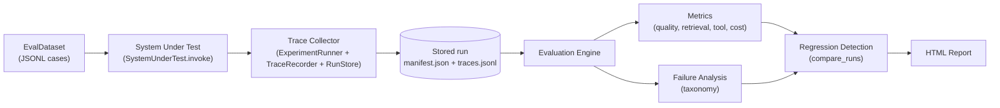

# AIRE: AI Reliability and Evaluation Engine

AIRE is a trace-based evaluation framework for LLM, RAG, and agent systems. It records what a system actually did (retrieved documents, tool calls, token usage, latencies), scores those records with deterministic metrics and pluggable judges, classifies failures into a fixed taxonomy, and compares runs to detect regressions between system versions.

## The problem

LLM-backed systems fail in ways that ordinary unit tests do not catch:

- A retrieval change can silently drop the document that contains the answer.
- A prompt or style change can make answers read better while removing the citations that made them verifiable.
- Replacing a component can improve one metric while degrading another, and nobody notices until a user does.

Scoring answers inside the application, or eyeballing outputs in a chat window, does not scale and is not reproducible. Teams need a recorded, comparable, version-to-version view of system behavior.

## The key idea

AIRE separates three concerns that are usually tangled together:

1. **Record traces.** Every invocation of the system under test produces a validated `Trace`: spans with real latencies, retrieved document ids, tool calls, and token usage. Traces are written once to a run directory (`manifest.json` plus `traces.jsonl`) and are never modified afterwards.
2. **Evaluate recorded traces.** Metrics, judges, and the failure taxonomy read traces. The system is never re-run to compute a score. Evaluation is therefore replayable: new metrics can be applied to old runs, and the same trace set feeds per-case results, aggregates, and reports.
3. **Compare runs.** The regression engine compares two evaluated runs metric by metric, using the direction from a metric registry (higher-better vs lower-better), relative thresholds to stay scale-free, and per-case attribution for every regression.

## Architecture



Module map:

| Module | Responsibility |
| --- | --- |
| `src/aire/schema.py` | `Trace`, `Span`, `Usage` dataclasses, token estimation, `validate_trace_dict` |
| `src/aire/llm/base.py` | `SystemUnderTest` and `Judge` interfaces, `SUTResult` |
| `src/aire/llm/deterministic.py` | `KeywordRetriever` (overlap and idf weighting) and the `ExtractiveRAG` demo system |
| `src/aire/runner/` | `EvalCase` dataset loading; `ExperimentRunner` with timeout and retry |
| `src/aire/tracing/` | `TraceRecorder` for fine-grained spans; `RunStore` for run directories |
| `src/aire/evaluator/` | `metrics.py`, `retrieval_metrics.py`, `tool_metrics.py`, `judges.py`, `engine.py` |
| `src/aire/regression/compare.py` | Relative-threshold run comparison with per-case attribution |
| `src/aire/report/html.py` | Static, dependency-free HTML reports |

## The three-version demo

`demo/run_demo.py` runs three versions of a small RAG system over `demo/eval_set.jsonl` (26 cases: answerable questions, unanswerable questions, and tool cases) and `demo/corpus/` (12 product documentation files):

- `v1_baseline`: overlap-weighted retrieval, top-1 document, faithful quoting with citations.
- `v2_improved`: idf-weighted retrieval, top-3 documents. Query words that appear in no document now drag the score down, which improves retrieval quality.
- `v3_fluent_regression`: same retrieval as v2, but the `fluent` style merges sentences and drops citations. This is a deliberate regression planted to show what the evaluator catches.

Aggregate results from the committed run (`results/`):

| Metric | v1 baseline | v2 improved | v3 fluent |
| --- | --- | --- | --- |
| retrieval_recall | 0.7273 | 0.9091 | 0.9545 |
| retrieval_mrr | 0.7727 | 0.8333 | 0.8485 |
| citation_coverage | 0.7273 | 0.7273 | 0.0000 |
| groundedness | 0.5682 | 0.5682 | 0.0000 |
| abstention_correct | 0.0 | 0.0 | 0.0 |

Regression verdicts:

- **v2 vs v1: no regressions detected** (2 improved, 7 neutral, 0 regressed). `retrieval_recall` improved from 0.7273 to 0.9091 and `retrieval_mrr` from 0.7727 to 0.8333; everything else held.
- **v3 vs v1: regressions detected** (2 regressed, 3 improved, 4 neutral). `citation_coverage` fell from 0.7273 to 0.0 and `groundedness` from 0.5682 to 0.0, because the fluent style drops citations. At the same time retrieval metrics improved (`retrieval_recall` 0.7273 to 0.9545, `retrieval_mrr` 0.7727 to 0.8485) and mean latency moved lower (0.215 ms to 0.2023 ms, inside the 10 percent noise threshold). Failure-count deltas: `ungrounded` +22, `incomplete_answer` -9, `retrieval_miss` -1. The report surfaces the fluency-versus-grounding trade-off instead of a single pass/fail number.

### A finding the evaluator surfaced: abstention does not work

`abstention_correct` is 0.0 for both v1 and v2. The unanswerable questions in the eval set are never refused. The measured reason: top retrieval scores for unanswerable queries fall between 0.18 and 0.46, while the minimum top scores for answerable queries fall between 0.19 and 0.26. The two ranges overlap, so no calibrated `min_score` threshold can separate answerable from unanswerable inputs. Deciding answerability requires semantic matching, which a bag-of-words retriever cannot do. The evaluator earns its place here: the metric exposed a real capability gap rather than hiding it behind an average. See `docs/interview_guide.md`.

## Real-LLM mode (recorded separately)

`python scripts/run_llm_eval.py` re-runs the same 26-case suite with an
`OpenAIChatResponder`: local IDF-weighted retrieval, real LLM generation
(gemini-2.5-flash via an OpenAI-compatible endpoint, temperature 0, API key
from the environment). The groundedness judge, failure taxonomy and regression
engine apply unchanged to real LLM answers. Results are stored separately from
the deterministic demo:

- `results/llm_eval_results.json` - per-case results, aggregates, real API token counts
- `results/llm_vs_deterministic.json` + `reports/llm_vs_deterministic_v2.html` - regression-engine comparison against deterministic v2

Real-LLM mode is nondeterministic and slower; the deterministic demo remains
the reproducible baseline. Measured run (2026-09-16, gemini-2.5-flash,
committed in `results/llm_eval_results.json`): 17/26 cases clean, with the
regression engine reporting vs deterministic v2 - abstention 0.0 -> 1.0
(improved: the LLM abstains correctly on all four unanswerable cases where
both deterministic versions answer), groundedness 0.5682 -> 1.0 (improved),
while citation coverage 0.7273 -> 0.6818, latency 0.3 ms -> 15.3 s and tokens
83 -> 605 per case regressed. Six cases failed on provider rate limits
(recorded as invocation errors) - operational reliability is part of the
measurement, and the report prices the whole trade-off rather than a single
number.

## Installation

Requires Python >= 3.10. AIRE has zero runtime dependencies; `pytest` is the only dev dependency.

```bash
cd aire
pip install -e .
```

Optional, for the test suite:

```bash
pip install -e ".[dev]"
```

No API keys are needed. The committed demo results were produced entirely offline by the deterministic responder in `src/aire/llm/deterministic.py`. See `.env.example` for the optional key used when attaching a real LLM adapter.

## Usage

Run the three-version demo end to end (writes `runs/`, `results/`, `reports/`):

```bash
python demo/run_demo.py
```

Outputs:

- `runs/<run_id>/` for each version: `manifest.json`, `traces.jsonl`, `eval_results.json`
- `results/v2_improved_vs_v1_baseline.json` and `results/v3_fluent_regression_vs_v1_baseline.json`: regression reports
- `reports/v2_improved_vs_v1_baseline.html` and `reports/v3_fluent_regression_vs_v1_baseline.html`: static dashboards (open in a browser)

Run the test suite (20 tests):

```bash
python -m pytest tests/ -q
```

Validate the evaluation set:

```bash
python demo/validate_eval_set.py
```

## Project structure

```
aire/
    pyproject.toml            zero runtime dependencies, Python >= 3.10
    src/aire/
        schema.py             Trace, Span, Usage, validate_trace_dict
        llm/
            base.py           SystemUnderTest, Judge, SUTResult
            deterministic.py  KeywordRetriever, ExtractiveRAG (demo stand-in)
        runner/
            dataset.py        EvalCase, JSONL dataset loading
            runner.py         ExperimentRunner: timeout, retry, span recording
        tracing/
            recorder.py       TraceRecorder for multi-span instrumentation
            storage.py        RunStore: manifest.json + traces.jsonl per run
        evaluator/
            metrics.py        keyword_recall, exact_match, citation_coverage,
                              groundedness, cost, metric_spec registry
            retrieval_metrics.py  recall@k, MRR
            tool_metrics.py   tool selection, argument validity and matching
            judges.py         GroundednessJudge, LLMJudge interface
            engine.py         EvaluationEngine, failure taxonomy, aggregates
        regression/
            compare.py        compare_runs, RegressionThresholds
        report/
            html.py           static HTML run and comparison reports
    demo/
        run_demo.py           three-version demo
        eval_set.jsonl        26 evaluation cases
        corpus/               12 Northwind Cloud documentation files
        validate_eval_set.py
    tests/test_aire.py        20 tests
    runs/                     stored run directories (tracked)
    results/                  committed JSON reports (tracked)
    reports/                  committed HTML reports (tracked)
    docs/
        interview_guide.md    design Q&A for reviews and interviews
        trace_schema.md       trace JSON schema and run directory layout
```

## Limitations

Stated plainly, because an evaluation tool that oversells itself is worthless:

- **Lexical groundedness is a proxy, not entailment.** The `groundedness` metric checks whether the content keywords of each cited sentence appear in the cited document (>= 50 percent overlap). It is cheap, deterministic, and auditable, but it can be fooled by paraphrases that share vocabulary with the source, and it may undercount legitimate rewordings. It measures citation hygiene, not semantic faithfulness.
- **The demo system under test is not an LLM.** `ExtractiveRAG` is a deterministic stand-in so that every committed number is exactly reproducible without network access or keys. The `SystemUnderTest` interface is the integration point for real LLM applications; nothing in the evaluator assumes a deterministic system.
- **Token counts are heuristic.** Without a real API response, usage is estimated at roughly 4 characters per token and labelled `token_source: "heuristic"` in every trace. Cost figures built on heuristic tokens are indicative only; the demo price table is 0 USD per 1k tokens for exactly this reason.
- **Abstention is an open gap in the demo.** As described above, keyword-overlap scoring cannot separate answerable from unanswerable queries (overlapping score ranges), so `abstention_correct` is 0.0 across the demo versions. Fixing it requires semantic matching in the retriever or an answerability classifier.
- **Retrieval ground truth is hand-declared.** Each case lists `supporting_doc_ids` by hand. Building reliable retrieval ground truth at scale is a separate, unsolved problem that this project does not pretend to solve.
- **Thread-based timeout leaks.** The runner enforces invocation timeouts with a watchdog thread; Python threads cannot be killed, so a hung call leaks its worker thread. The watchdog bounds the runner's wait, not the underlying work.
- **Latency in the demo is not LLM latency.** Sub-millisecond extractive answering says nothing about production latency behavior; the latency metric and its thresholds matter once a real system is attached.
